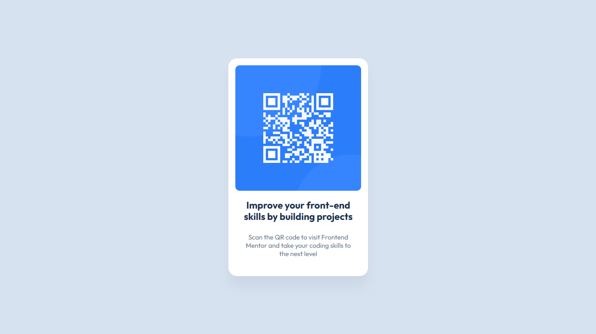

# Frontend Mentor - QR code component solution

Esta é uma solução para o [QR code component challenge on Frontend Mentor](https://www.frontendmentor.io/challenges/qr-code-component-iux_sIO_H).

## Tabela de Conteúdo

- [Frontend Mentor - QR code component solution](#frontend-mentor---qr-code-component-solution)
  - [Tabela de Conteúdo](#tabela-de-conteúdo)
    - [Screenshot](#screenshot)
    - [Links](#links)
  - [Meu Processo](#meu-processo)
    - [Feito com](#feito-com)
    - [Recursos usados](#recursos-usados)
  - [Author](#author)

### Screenshot

### Links

- Live Site URL: [Qr Code](https://matheusrbmdev.github.io/qr-code-challenge-frontendmentor/)

## Meu Processo

### Feito com

- Variáveis CSS
- Flexbox

### Recursos usados

- [Box Shadows](https://www.w3schools.com/css/css3_shadows_box.asp) - Me ajudou com o sombreamento do card, me ajudando a entender cada medida da propriedade

- [Variáveis CSS](https://www.w3schools.com/css/css3_variables.asp) - Esta característica maravilhosa do CSS, me permitiu criar variáveis para serem reutilizadas em várias das outras propriedades no CSS.

## Author

- Website - [Matheus Rossi]()
- Frontend Mentor - [@matheusrbmdev](https://www.frontendmentor.io/profile/matheusrbmdev)
